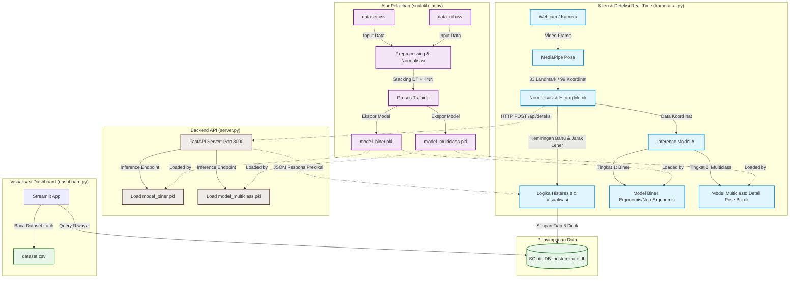

# Arsitektur Sistem PostureMate

Dokumen ini menjelaskan arsitektur sistem dari **PostureMate**, sebuah sistem klasifikasi postur duduk mahasiswa secara *real-time* berbasis kecerdasan buatan (AI) dengan visualisasi dashboard analitik.

---

## 1. Diagram Arsitektur Sistem

Berikut adalah diagram alur dan arsitektur sistem PostureMate dalam format Mermaid:

---

## 2. Penjelasan Komponen Utama

### A. Klien & Deteksi Real-Time (`kamera_ai.py`)
Modul ini bertindak sebagai antarmuka input dan pemrosesan visual awal bagi pengguna:
*   **Webcam / Kamera**: Mengambil tangkapan video secara langsung (*frame-by-frame*).
*   **MediaPipe Pose**: Mengekstrak 33 koordinat 3D tubuh (*world landmarks*).
*   **Normalisasi & Metrik**: 
    *   Menghitung sudut kemiringan bahu secara trigonometris.
    *   Menghitung jarak relatif leher-ke-bahu berbasis koordinat sumbu Z.
    *   Menormalisasi 99 nilai koordinat (33 titik × X, Y, Z) agar klasifikasi model bersifat invarian terhadap jarak pengguna ke kamera.
*   **Inference Model AI**: Memprediksi postur secara bertingkat:
    1.  **Tingkat 1 (Biner)**: Menentukan apakah postur pengguna *Ergonomis* atau *Non-Ergonomis*.
    2.  **Tingkat 2 (Multiclass)**: Jika postur dideteksi *Non-Ergonomis*, model ini memprediksi kategori spesifik (misalnya: *TLF/Condong Depan*, *TLB/Terlalu Bersandar*, dll.).
*   **Logika Histeresis & Visualisasi**: Mengatasi fluktuasi deteksi (*noise*) agar pergantian status tidak terlalu cepat berubah. Visualisasi langsung di overlay video (bingkai warna merah/hijau).

### B. Backend API (`server.py`)
Server berbasis **FastAPI** yang berjalan pada port 8000 secara lokal.
*   Menyediakan endpoint `/api/deteksi` untuk menerima payload JSON berisi 99 koordinat mentah.
*   Melakukan kalkulasi metrik dan normalisasi secara independen di sisi server, lalu memprosesnya menggunakan model AI (`model_biner.pkl` dan `model_multiclass.pkl`) yang telah dimuat di memori pada saat *startup*.

### C. Penyimpanan Data (`posturemate.db`)
Basis data **SQLite** yang digunakan untuk menyimpan riwayat deteksi postur pengguna secara berkala (setiap 5 detik). Menyimpan kolom:
*   `timestamp`: Waktu perekaman.
*   `status_postur`: Hasil klasifikasi utama (*Ergonomis* / *Non-Ergonomis*).
*   `kemiringan_bahu`: Nilai sudut kemiringan bahu (dalam derajat).
*   `jarak_leher`: Nilai jarak relatif leher ke bahu (dalam cm).
*   `pesan`: Detail teks peringatan.
*   `detail_postur`: Klasifikasi detail dari model multiclass (*TUP*, *TLF*, *TLB*, *TLL*, *TLR*).

### D. Visualisasi Dashboard (`dashboard.py`)
Aplikasi berbasis web interaktif menggunakan **Streamlit** untuk menampilkan analitik perilaku pengguna:
*   Mengambil data dari `posturemate.db` secara dinamis.
*   Menyajikan tab statistik seperti **Ringkasan Sesi** (durasi, skor kebaikan postur), **Tren Waktu** (metrik bahu dan leher), dan **Distribusi Masalah** (jenis kesalahan posisi duduk yang paling sering dilakukan).
*   Eksplorasi dataset pelatihan (`dataset.csv`).

### E. Alur Pelatihan AI (`src/latih_ai.py`)
Proses *offline training* untuk melatih dan mengekspor model prediksi:
*   Membaca dataset publik (`dataset.csv`) dan data riil hasil rekaman pengguna (`data_riil.csv`).
*   Melakukan preprocessing dan ekstraksi fitur menggunakan `SelectFromModel` berbasis Decision Tree.
*   Menggunakan arsitektur **Stacking Ensemble** (Decision Tree + K-Nearest Neighbors) untuk menghasilkan akurasi yang lebih robust.
*   Menyimpan model terlatih sebagai file *pickle* (`model_biner.pkl` dan `model_multiclass.pkl`).

---

## 3. Alur Aliran Data (Data Flow)

1.  **Sesi Training (Offline)**:
    $$\text{Data Mentah (CSV)} \longrightarrow \text{Normalisasi} \longrightarrow \text{Training Pipeline (Stacking)} \longrightarrow \text{Model Pickle (.pkl)}$$
2.  **Sesi Deteksi Real-Time**:
    $$\text{Frame Video} \longrightarrow \text{MediaPipe} \longrightarrow \text{Koordinat 3D} \longrightarrow \text{API FastAPI / Model Lokal} \longrightarrow \text{Prediksi}$$
3.  **Sesi Penyimpanan & Visualisasi**:
    $$\text{Hasil Prediksi} \xrightarrow{\text{Setiap 5 Detik}} \text{SQLite (DB)} \longrightarrow \text{Streamlit Dashboard} \longrightarrow \text{Grafik & Metrik (User)}$$
